# Chimera 渲染引擎设计图体系 (PlantUML)

本文件存储了 Chimera 渲染引擎在需求分析与概要设计阶段对应的所有用例图、类图及架构图代码。

---
# 第一部分：用例图 (需求分析)

## 1. 场景与资产管理用例图
**建议导出文件名：** `scene_management_usecase.png` (对应 LaTeX Label: `fig:scene_usecase`)

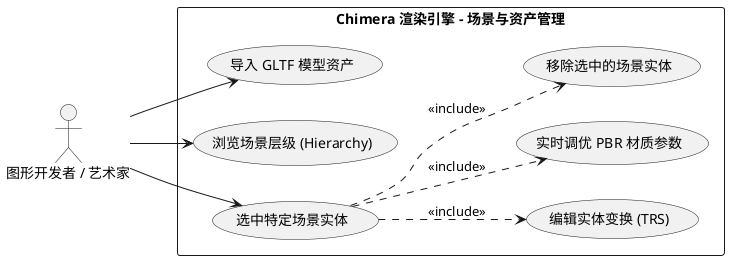

## 2. 渲染控制与参数配置用例图
**建议导出文件名：** `rendering_control_usecase.png` (对应 LaTeX Label: `fig:pipeline_usecase`)

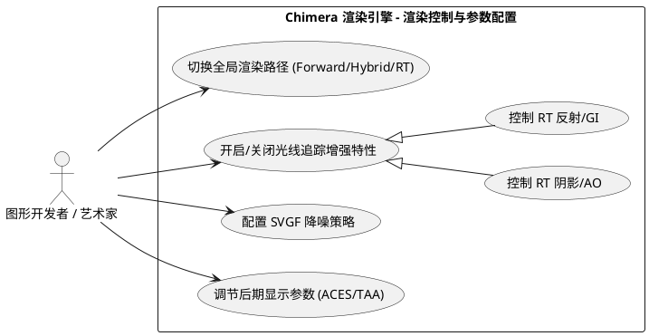

## 3. 调试与可视化监控用例图
**建议导出文件名：** `visualization_debug_usecase.png` (对应 LaTeX Label: `fig:debug_usecase`)

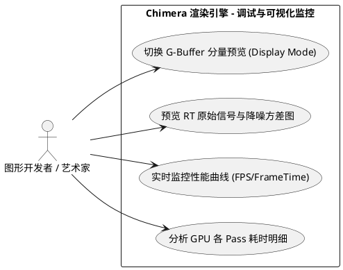

---
# 第二部分：类图 (概要设计)

## 4. 全局管理与分层框架类图
**建议导出文件名：** `framework_class_diagram.png` (对应 LaTeX Label: `fig:framework_class_diagram`)

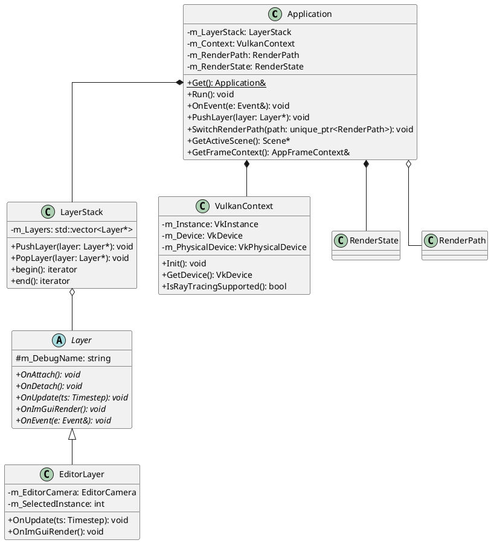

## 5. 资源管理与场景组织类图
**建议导出文件名：** `resource_scene_class_diagram.png` (对应 LaTeX Label: `fig:resource_scene_class_diagram`)

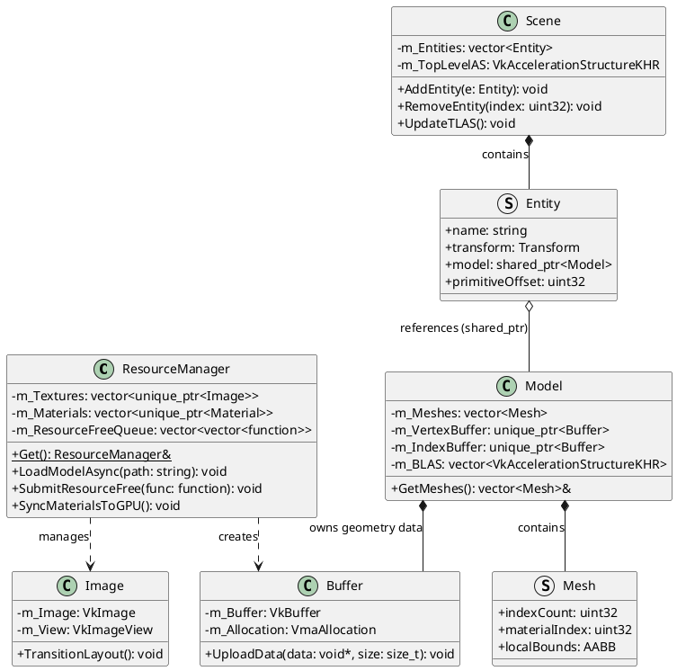

## 6. RenderGraph 调度引擎类图
**建议导出文件名：** `rendergraph_engine_class_diagram.png` (对应 LaTeX Label: `fig:rendergraph_engine_class_diagram`)

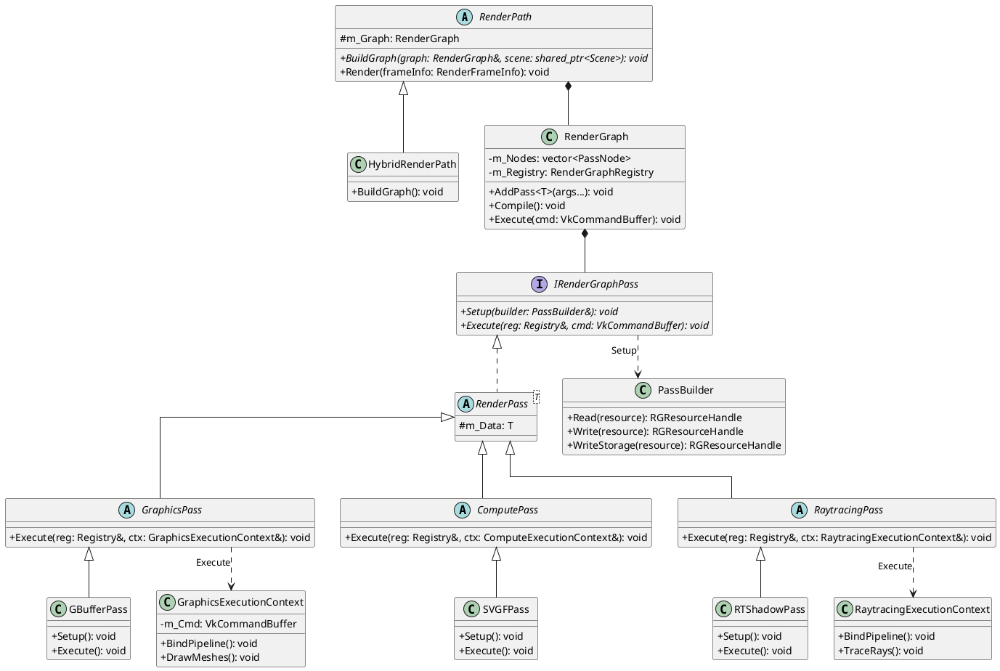

---
# 第三部分：系统架构图

## 7. Chimera 引擎五层分层拓扑架构图
**建议导出文件名：** `renderer_architecture.png` (对应 LaTeX Label: `fig:renderer_architecture`)

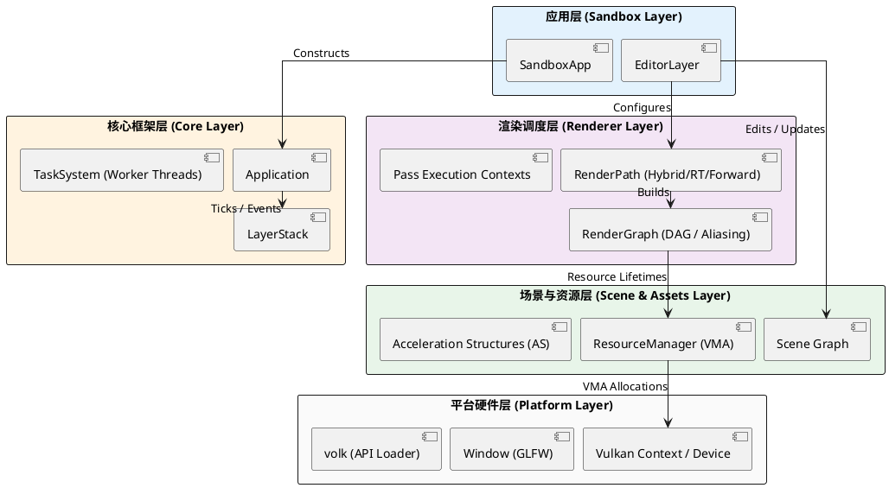

---
## 8. 系统渲染数据流图 (DFD)
**建议导出文件名：** `render_dfd.png` (对应 LaTeX Label: `fig:render_dfd`)

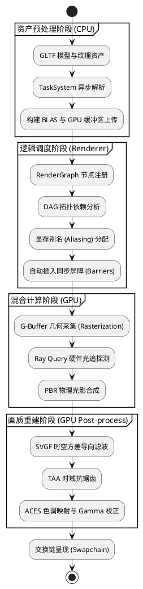

---
## 11. SVGF 降噪管线数据流转与逻辑拓扑图
**建议导出文件名：** `svgf_pipeline_data_flow.png` (对应 LaTeX Label: `fig:svgf_pipeline`)

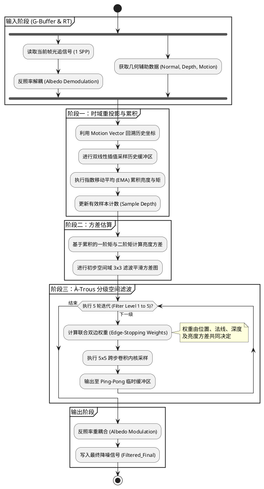

---
## 10. 信号重建时域历史持久化机制图
**建议导出文件名：** `history_persistent_mechanism.png` (对应 LaTeX Label: `fig:history_mechanism`)

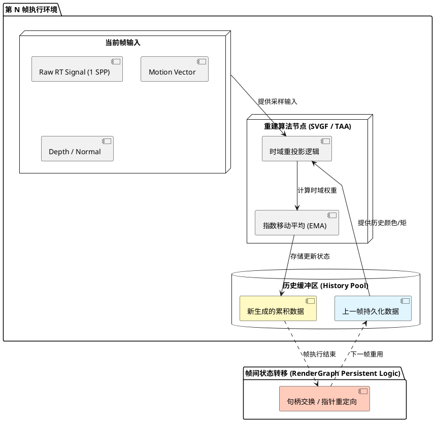

---
## 9. RenderGraph 运行生命周期流程图
**建议导出文件名：** `render_graph_lifecycle_flow.png` (对应 LaTeX Label: `fig:render_graph_lifecycle`)

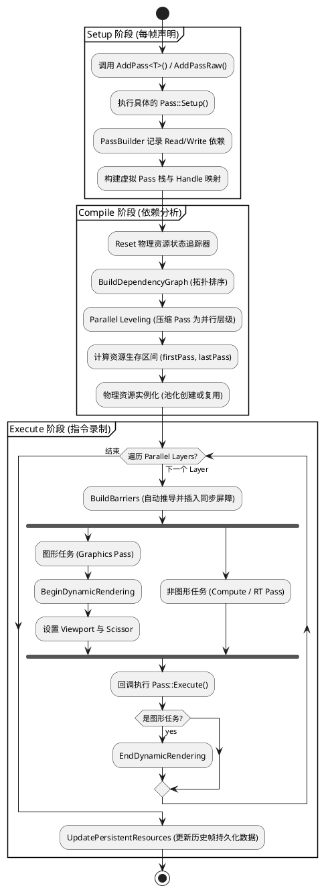

---
# 第四部分：软工详细设计动态图

## 12. 应用单帧生命周期活动图
**建议导出文件名：** `app_frame_activity.png` (对应 LaTeX Label: `fig:app_activity`)

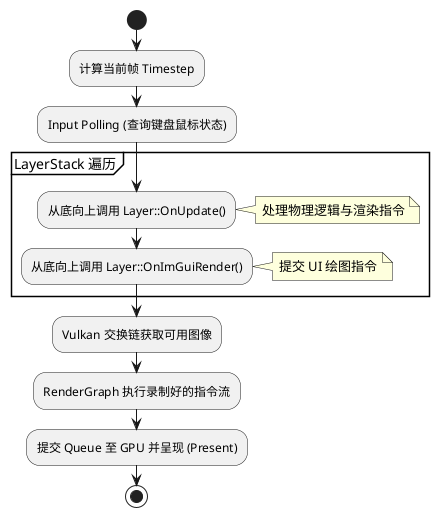

## 13. 异步资源加载处理顺序图
**建议导出文件名：** `async_loading_sequence.png` (对应 LaTeX Label: `fig:loading_sequence`)

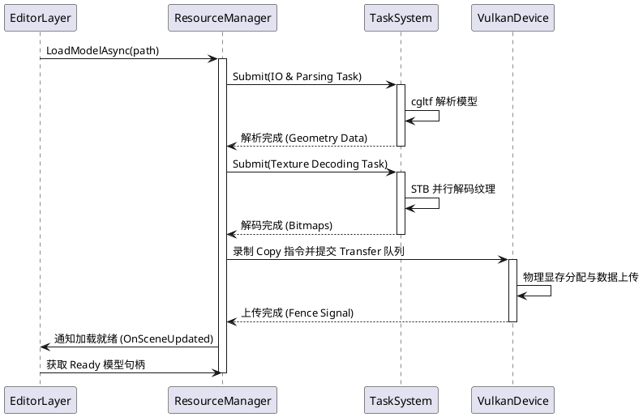

## 14. 渲染图自动同步执行顺序图
**建议导出文件名：** `rg_sync_sequence.png` (对应 LaTeX Label: `fig:sync_sequence`)

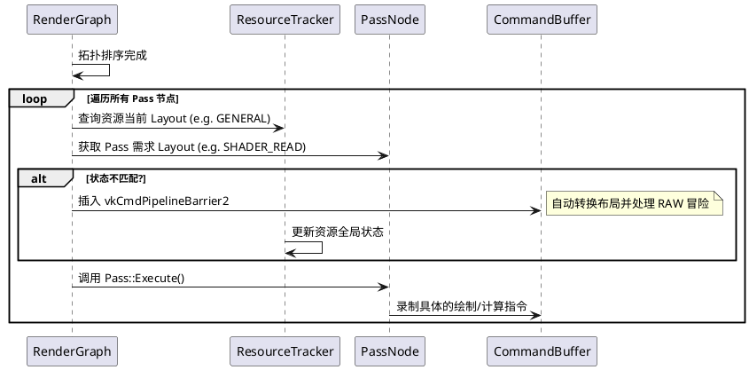

## 15. 渲染参数动态调节顺序图
**建议导出文件名：** `param_adjustment_sequence.png` (对应 LaTeX Label: `fig:param_sequence`)

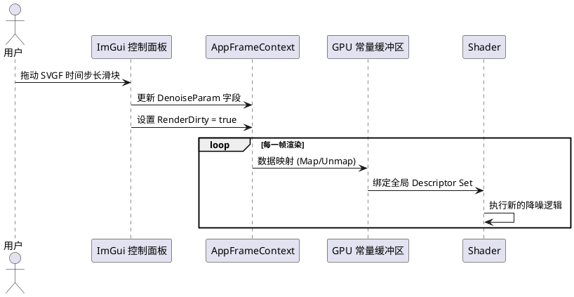

