# 本渲染引擎设计图体系 (PlantUML)

本文件存储了本渲染引擎在需求分析与概要设计阶段对应的所有用例图、类图及架构图代码。

---
# 第一部分：用例图 (需求分析)

## 1. 场景与资产管理用例图
**建议导出文件名：** `scene_management_usecase.png` (对应 LaTeX Label: `fig:scene_usecase`)

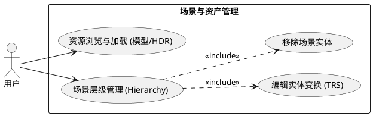
```plantuml
@startuml
left to right direction
skinparam packageStyle rectangle

actor "用户" as User

rectangle "场景与资产管理" {
    usecase "资源浏览与加载 (模型/HDR)" as UC1
    usecase "场景层级管理 (Hierarchy)" as UC2
    usecase "编辑实体变换 (TRS)" as UC4
    usecase "移除场景实体" as UC5
}

User --> UC1
User --> UC2

UC2 ..> UC4 : <<include>>
UC2 ..> UC5 : <<include>>
@enduml

```

## 2. Debug UI 交互用例图
**建议导出文件名：** `rendering_control_usecase.png` (对应 LaTeX Label: `fig:pipeline_usecase`)

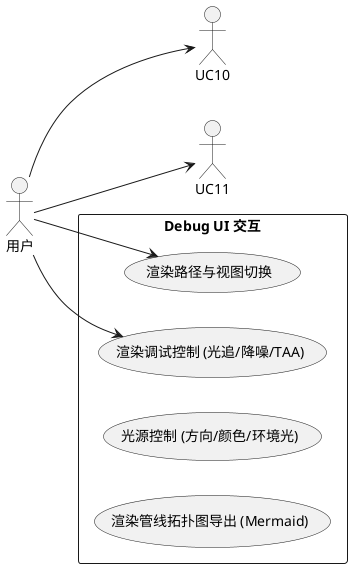
```plantuml
@startuml
left to right direction
skinparam packageStyle rectangle

actor "用户" as User

rectangle "Debug UI 交互" {
    usecase "渲染路径与视图切换" as UC6
    usecase "渲染调试控制 (光追/降噪/TAA)" as UC7
    usecase "光源控制 (方向/颜色/环境光)" as UC8
    usecase "渲染管线拓扑图导出 (Mermaid)" as UC9
}

User --> UC6
User --> UC7
User --> UC10
User --> UC11

@enduml
```

## 3. 场景交互与观察用例图
**建议导出文件名：** `visualization_debug_usecase.png` (对应 LaTeX Label: `fig:debug_usecase`)

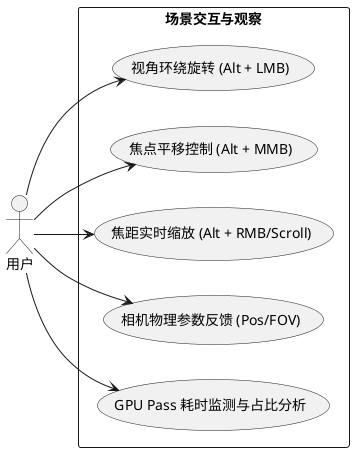
```plantuml
@startuml
left to right direction
skinparam packageStyle rectangle

actor "用户" as User

rectangle "场景交互与观察" {
    usecase "视角环绕旋转 (Alt + LMB)" as UC10
    usecase "焦点平移控制 (Alt + MMB)" as UC11
    usecase "焦距实时缩放 (Alt + RMB/Scroll)" as UC12
    usecase "相机物理参数反馈 (Pos/FOV)" as UC13
    usecase "GPU Pass 耗时监测与占比分析" as UC14
}

User --> UC10
User --> UC11
User --> UC12
User --> UC13
User --> UC14

@enduml
```

---
# 第二部分：类图 (概要设计)

## 4. 全局管理与分层框架类图
**建议导出文件名：** `framework_class_diagram.png` (对应 LaTeX Label: `fig:framework_class_diagram`)

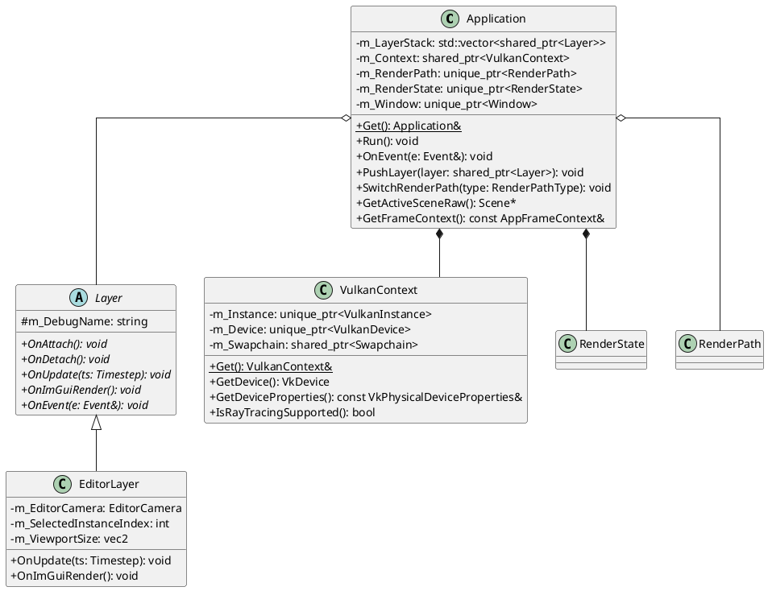
```plantuml
@startuml
skinparam classAttributeIconSize 0
skinparam linetype ortho

class Application {
    - m_LayerStack: std::vector<shared_ptr<Layer>>
    - m_Context: shared_ptr<VulkanContext>
    - m_RenderPath: unique_ptr<RenderPath>
    - m_RenderState: unique_ptr<RenderState>
    - m_Window: unique_ptr<Window>
    + {static} Get(): Application&
    + Run(): void
    + OnEvent(e: Event&): void
    + PushLayer(layer: shared_ptr<Layer>): void
    + SwitchRenderPath(type: RenderPathType): void
    + GetActiveSceneRaw(): Scene*
    + GetFrameContext(): const AppFrameContext&
}

abstract class Layer {
    # m_DebugName: string
    + {abstract} OnAttach(): void
    + {abstract} OnDetach(): void
    + {abstract} OnUpdate(ts: Timestep): void
    + {abstract} OnImGuiRender(): void
    + {abstract} OnEvent(e: Event&): void
}

class EditorLayer {
    - m_EditorCamera: EditorCamera
    - m_SelectedInstanceIndex: int
    - m_ViewportSize: vec2
    + OnUpdate(ts: Timestep): void
    + OnImGuiRender(): void
}

class VulkanContext {
    - m_Instance: unique_ptr<VulkanInstance>
    - m_Device: unique_ptr<VulkanDevice>
    - m_Swapchain: shared_ptr<Swapchain>
    + {static} Get(): VulkanContext&
    + GetDevice(): VkDevice
    + GetDeviceProperties(): const VkPhysicalDeviceProperties&
    + IsRayTracingSupported(): bool
}

' Relationships
Application o-- Layer
Application *-- VulkanContext
Application *-- RenderState
Application o-- RenderPath
Layer <|-- EditorLayer
@enduml
```

## 5. 资源管理与场景组织类图
**建议导出文件名：** `resource_scene_class_diagram.png` (对应 LaTeX Label: `fig:resource_scene_class_diagram`)

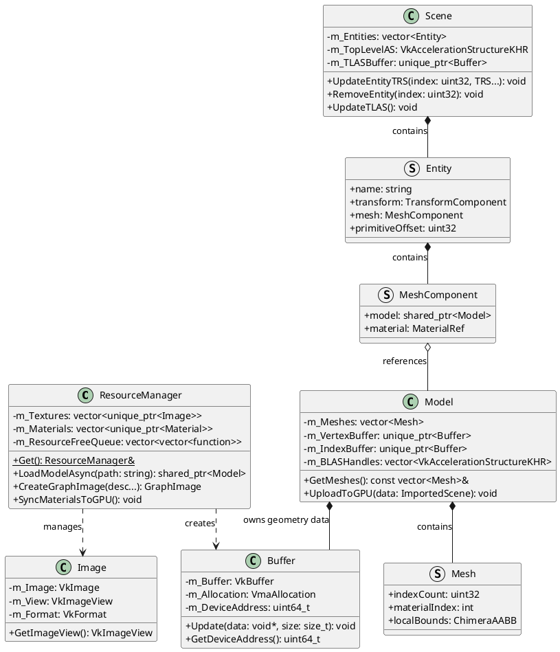
```plantuml
@startuml
skinparam classAttributeIconSize 0
skinparam linetype ortho

' --- 资源层 ---
class ResourceManager {
    - m_Textures: vector<unique_ptr<Image>>
    - m_Materials: vector<unique_ptr<Material>>
    - m_ResourceFreeQueue: vector<vector<function>>
    + {static} Get(): ResourceManager&
    + LoadModelAsync(path: string): shared_ptr<Model>
    + CreateGraphImage(desc...): GraphImage
    + SyncMaterialsToGPU(): void
}

class Buffer {
    - m_Buffer: VkBuffer
    - m_Allocation: VmaAllocation
    - m_DeviceAddress: uint64_t
    + Update(data: void*, size: size_t): void
    + GetDeviceAddress(): uint64_t
}

class Image {
    - m_Image: VkImage
    - m_View: VkImageView
    - m_Format: VkFormat
    + GetImageView(): VkImageView
}

' --- 场景层 ---
class Scene {
    - m_Entities: vector<Entity>
    - m_TopLevelAS: VkAccelerationStructureKHR
    - m_TLASBuffer: unique_ptr<Buffer>
    + UpdateEntityTRS(index: uint32, TRS...): void
    + RemoveEntity(index: uint32): void
    + UpdateTLAS(): void
}

struct Entity {
    + name: string
    + transform: TransformComponent
    + mesh: MeshComponent
    + primitiveOffset: uint32
}

struct MeshComponent {
    + model: shared_ptr<Model>
    + material: MaterialRef
}

class Model {
    - m_Meshes: vector<Mesh>
    - m_VertexBuffer: unique_ptr<Buffer>
    - m_IndexBuffer: unique_ptr<Buffer>
    - m_BLASHandles: vector<VkAccelerationStructureKHR>
    + GetMeshes(): const vector<Mesh>&
    + UploadToGPU(data: ImportedScene): void
}

struct Mesh {
    + indexCount: uint32
    + materialIndex: int
    + localBounds: ChimeraAABB
}

' --- 关系 ---
ResourceManager ..> Buffer : "creates"
ResourceManager ..> Image : "manages"

Scene *-- Entity : "contains"
Entity *-- MeshComponent : "contains"
MeshComponent o-- Model : "references"
Model *-- Mesh : "contains"
Model *-- Buffer : "owns geometry data"

@enduml
```

## 6. RenderGraph 调度引擎类图
**建议导出文件名：** `rendergraph_engine_class_diagram.png` (对应 LaTeX Label: `fig:rendergraph_engine_class_diagram`)

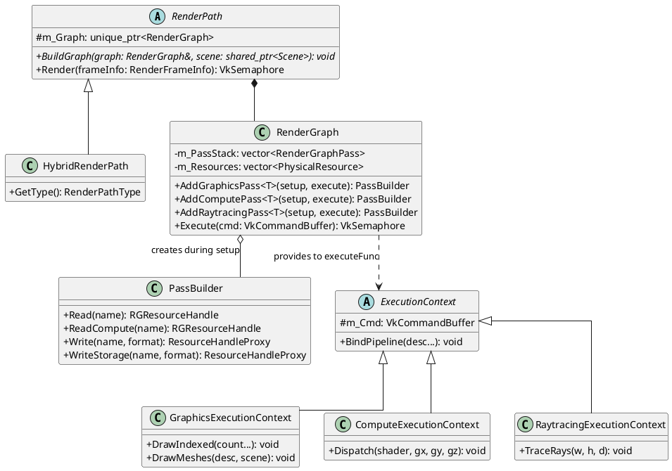
```plantuml
@startuml
skinparam classAttributeIconSize 0
skinparam linetype ortho

' --- 1. Orchestration ---
abstract class RenderPath {
    # m_Graph: unique_ptr<RenderGraph>
    + {abstract} BuildGraph(graph: RenderGraph&, scene: shared_ptr<Scene>): void
    + Render(frameInfo: RenderFrameInfo): VkSemaphore
}

class HybridRenderPath {
    + GetType(): RenderPathType
}

class RenderGraph {
    - m_PassStack: vector<RenderGraphPass>
    - m_Resources: vector<PhysicalResource>
    + AddGraphicsPass<T>(setup, execute): PassBuilder
    + AddComputePass<T>(setup, execute): PassBuilder
    + AddRaytracingPass<T>(setup, execute): PassBuilder
    + Execute(cmd: VkCommandBuffer): VkSemaphore
}

' --- 2. Pass Builder & Hierarchy ---
class PassBuilder {
    + Read(name): RGResourceHandle
    + ReadCompute(name): RGResourceHandle
    + Write(name, format): ResourceHandleProxy
    + WriteStorage(name, format): ResourceHandleProxy
}

abstract class ExecutionContext {
    # m_Cmd: VkCommandBuffer
    + BindPipeline(desc...): void
}

class GraphicsExecutionContext {
    + DrawIndexed(count...): void
    + DrawMeshes(desc, scene): void
}

class ComputeExecutionContext {
    + Dispatch(shader, gx, gy, gz): void
}

class RaytracingExecutionContext {
    + TraceRays(w, h, d): void
}

' --- Relationships ---
RenderPath <|-- HybridRenderPath
RenderPath *-- RenderGraph

RenderGraph o-- PassBuilder : "creates during setup"
RenderGraph ..> ExecutionContext : "provides to executeFunc"

ExecutionContext <|-- GraphicsExecutionContext
ExecutionContext <|-- ComputeExecutionContext
ExecutionContext <|-- RaytracingExecutionContext

@enduml
```

---
# 第三部分：系统架构图

## 7. 五层分层拓扑架构图
**建议导出文件名：** `renderer_architecture.png` (对应 LaTeX Label: `fig:renderer_architecture`)

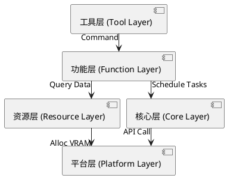
```plantuml
@startuml
skinparam packageStyle rectangle
skinparam linetype ortho
skinparam nodesep 10
skinparam ranksep 30

' 严格的上下层依赖关系
[工具层 (Tool Layer)] --> [功能层 (Function Layer)] : "Command"
[功能层 (Function Layer)] --> [资源层 (Resource Layer)] : "Query Data"
[功能层 (Function Layer)] --> [核心层 (Core Layer)] : "Schedule Tasks"
[资源层 (Resource Layer)] --> [平台层 (Platform Layer)] : "Alloc VRAM"
[核心层 (Core Layer)] --> [平台层 (Platform Layer)] : "API Call"

@enduml
```

---
## 8. 系统渲染数据流图 (DFD)
**建议导出文件名：** `render_dfd.png` (对应 LaTeX Label: `fig:render_dfd`)

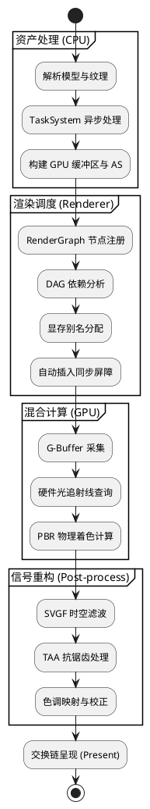
```plantuml
@startuml
skinparam backgroundColor white
skinparam shadowing false

start

partition "资产处理 (CPU)" {
    :解析模型与纹理;
    :TaskSystem 异步处理;
    :构建 GPU 缓冲区与 AS;
}

partition "渲染调度 (Renderer)" {
    :RenderGraph 节点注册;
    :DAG 依赖分析;
    :显存别名分配;
    :自动插入同步屏障;
}

partition "混合计算 (GPU)" {
    :G-Buffer 采集;
    :硬件光追射线查询;
    :PBR 物理着色计算;
}

partition "信号重构 (Post-process)" {
    :SVGF 时空滤波;
    :TAA 抗锯齿处理;
    :色调映射与校正;
}

:交换链呈现 (Present);

stop
@enduml
```

---
## 11. SVGF 降噪管线流程图
**建议导出文件名：** `svgf_pipeline_data_flow.png` (对应 LaTeX Label: `fig:svgf_pipeline`)

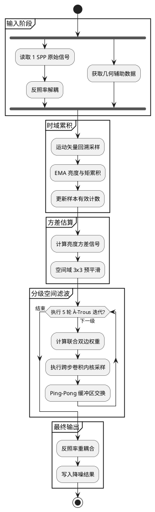
```plantuml
@startuml
skinparam backgroundColor white
skinparam shadowing false

start

partition "输入阶段" {
    fork
        :读取 1 SPP 原始信号;
        :反照率解耦;
    fork again
        :获取几何辅助数据;
    end fork
}

partition "时域累积" {
    :运动矢量回溯采样;
    :EMA 亮度与矩累积;
    :更新样本有效计数;
}

partition "方差估算" {
    :计算亮度方差信号;
    :空间域 3x3 预平滑;
}

partition "分级空间滤波" {
    while (执行 5 轮 À-Trous 迭代?) is (下一级)
        :计算联合双边权重;
        :执行跨步卷积内核采样;
        :Ping-Pong 缓冲区交换;
    endwhile (结束)
}

partition "最终输出" {
    :反照率重耦合;
    :写入降噪结果;
}

stop
@enduml
```

---
## 10. 时域历史持久化机制图
**建议导出文件名：** `history_persistent_mechanism.png` (对应 LaTeX Label: `fig:history_mechanism`)

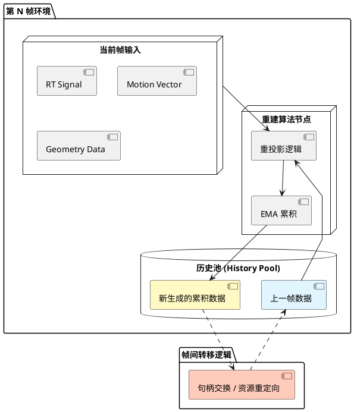
```plantuml
@startuml
skinparam backgroundColor white
skinparam shadowing false
skinparam linetype polyline

package "第 N 帧环境" {
    node "当前帧输入" as CurrentFrame {
        [RT Signal]
        [Motion Vector]
        [Geometry Data]
    }

    node "重建算法节点" as Pass {
        component "重投影逻辑" as Reprojection
        component "EMA 累积" as Accumulation
    }

    database "历史池 (History Pool)" {
        [上一帧数据] as History_Read #E1F5FE
        [新生成的累积数据] as History_Write #FFF9C4
    }
}

package "帧间转移逻辑" {
    [句柄交换 / 资源重定向] as Swap #FFCCBC
}

' Data Flow
CurrentFrame --> Reprojection
History_Read --> Reprojection
Reprojection --> Accumulation
Accumulation --> History_Write

' Lifecycle
History_Write ..> Swap
Swap ..> History_Read

@enduml
```

---
## 9. RenderGraph 生命周期流程图
**建议导出文件名：** `render_graph_lifecycle_flow.png` (对应 LaTeX Label: `fig:render_graph_lifecycle`)

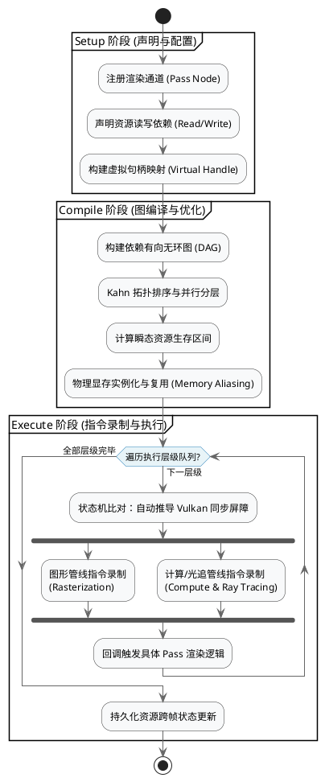
```plantuml
@startuml
skinparam ActivityBackgroundColor #F8F9FA
skinparam ActivityBorderColor #333333
skinparam ActivityDiamondBackgroundColor #E8F4F8
skinparam ActivityDiamondBorderColor #2980B9
skinparam ArrowColor #666666

start

partition "Setup 阶段 (声明与配置)" {
    :注册渲染通道 (Pass Node);
    :声明资源读写依赖 (Read/Write);
    :构建虚拟句柄映射 (Virtual Handle);
}

partition "Compile 阶段 (图编译与优化)" {
    :构建依赖有向无环图 (DAG);
    :Kahn 拓扑排序与并行分层;
    :计算瞬态资源生存区间;
    :物理显存实例化与复用 (Memory Aliasing);
}

partition "Execute 阶段 (指令录制与执行)" {
    while (遍历执行层级队列?) is (下一层级)
        :状态机比对：自动推导 Vulkan 同步屏障;
        fork
            :图形管线指令录制\n(Rasterization);
        fork again
            :计算/光追管线指令录制\n(Compute & Ray Tracing);
        end fork
        :回调触发具体 Pass 渲染逻辑;
    endwhile (全部层级完毕)
    :持久化资源跨帧状态更新;
}

stop
@enduml
```

---
# 第四部分：动态逻辑图

## 12. 单帧生命周期活动图
**建议导出文件名：** `app_frame_activity.png` (对应 LaTeX Label: `fig:app_activity`)

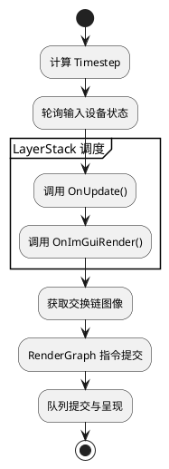
```plantuml
@startuml
skinparam backgroundColor white
skinparam shadowing false

start
:计算 Timestep;
:轮询输入设备状态;
partition "LayerStack 调度" {
    :调用 OnUpdate();
    :调用 OnImGuiRender();
}
:获取交换链图像;
:RenderGraph 指令提交;
:队列提交与呈现;
stop
@enduml
```

## 13. 异步加载顺序图
**建议导出文件名：** `async_loading_sequence.png` (对应 LaTeX Label: `fig:loading_sequence`)

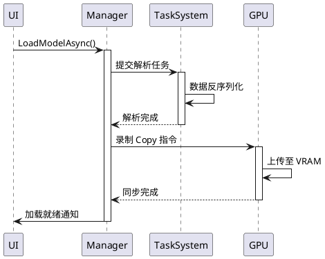
```plantuml
@startuml
skinparam backgroundColor white
participant "UI" as UI
participant "Manager" as RM
participant "TaskSystem" as TS
participant "GPU" as GPU

UI -> RM : LoadModelAsync()
activate RM
RM -> TS : 提交解析任务
activate TS
TS -> TS : 数据反序列化
TS --> RM : 解析完成
deactivate TS

RM -> GPU : 录制 Copy 指令
activate GPU
GPU -> GPU : 上传至 VRAM
GPU --> RM : 同步完成
deactivate GPU

RM -> UI : 加载就绪通知
deactivate RM
@enduml
```

## 14. RenderGraph 自动同步顺序图
**建议导出文件名：** `rg_sync_sequence.png` (对应 LaTeX Label: `fig:sync_sequence`)

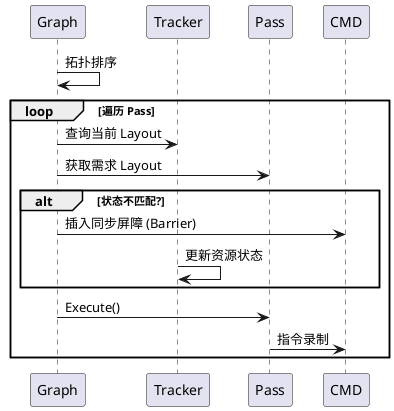
```plantuml
@startuml
skinparam backgroundColor white
participant "Graph" as RG
participant "Tracker" as TR
participant "Pass" as PN
participant "CMD" as CMD

RG -> RG : 拓扑排序
loop 遍历 Pass
    RG -> TR : 查询当前 Layout
    RG -> PN : 获取需求 Layout
    
    alt 状态不匹配?
        RG -> CMD : 插入同步屏障 (Barrier)
        TR -> TR : 更新资源状态
    end
    
    RG -> PN : Execute()
    PN -> CMD : 指令录制
end
@enduml
```

---
## 33. 交互调试模块静态组件协作图
**建议导出文件名：** `debug_module_collaboration.png` (对应 LaTeX Label: `fig:debug_collab`)

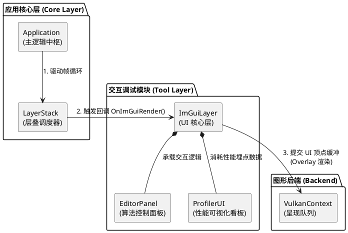
```plantuml
@startuml
skinparam componentStyle rectangle
skinparam monochrome true
skinparam shadowing false

package "交互调试模块 (Tool Layer)" {
    component "ImGuiLayer\n(UI 核心层)" as ImGuiCore
    component "EditorPanel\n(算法控制面板)" as Panel
    component "ProfilerUI\n(性能可视化看板)" as Profiler
}

package "应用核心层 (Core Layer)" {
    component "Application\n(主逻辑中枢)" as App
    component "LayerStack\n(层叠调度器)" as Stack
}

package "图形后端 (Backend)" {
    component "VulkanContext\n(呈现队列)" as Context
}

App -down-> Stack : 1. 驱动帧循环
Stack -right-> ImGuiCore : 2. 触发回调 OnImGuiRender()
ImGuiCore *-- Panel : 承载交互逻辑
ImGuiCore *-- Profiler : 消耗性能埋点数据

ImGuiCore -down-> Context : 3. 提交 UI 顶点缓冲\n(Overlay 渲染)
@enduml
```

## 34. 基于 Vulkan 时间戳的性能监控时序图
**建议导出文件名：** `vulkan_timestamp_sequence.png` (对应 LaTeX Label: `fig:timestamp_sequence`)

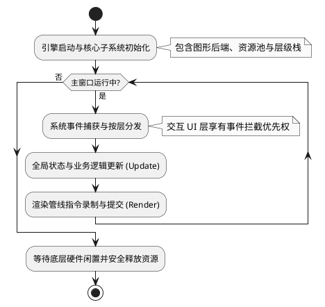
```plantuml
@startuml
skinparam monochrome true
skinparam shadowing false

participant "RenderGraph" as RG
participant "GPU 硬件计数器" as HW
participant "Profiler 统计单元" as Stats

RG -> HW : vkCmdWriteTimestamp(Pass 起点)
activate HW
RG -> RG : 执行具体渲染 Pass (如 GBuffer)
RG -> HW : vkCmdWriteTimestamp(Pass 终点)
deactivate HW

... 帧结束同步点 ...

Stats -> HW : vkGetQueryPoolResults()
activate HW
HW --> Stats : 返回纳秒级原始 Tick
deactivate HW

---
## 35. 引擎主循环与事件驱动高层抽象活动图
**建议导出文件名：** `engine_lifecycle_activity.png` (对应 LaTeX Label: `fig:engine_lifecycle`)

```plantuml
@startuml
skinparam monochrome true
skinparam shadowing false

start
:引擎启动与核心子系统初始化;
note right: 包含图形后端、资源池与层级栈

while (主窗口运行中?) is (是)
  :系统事件捕获与按层分发;
  note right: 交互 UI 层享有事件拦截优先权
  
  :全局状态与业务逻辑更新 (Update);
  
  :渲染管线指令录制与提交 (Render);
endwhile (否)

:等待底层硬件闲置并安全释放资源;
stop
@enduml
```

## 36. 渲染参数实时控制与显存同步数据流向图
**建议导出文件名：** `parameter_sync_dataflow.png` (对应 LaTeX Label: `fig:param_dataflow`)

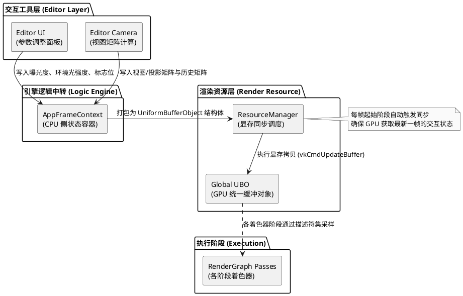
```plantuml
@startuml
skinparam componentStyle rectangle
skinparam monochrome true
skinparam shadowing false

package "交互工具层 (Editor Layer)" {
    component "Editor UI\n(参数调整面板)" as Panel
    component "Editor Camera\n(视图矩阵计算)" as Camera
}

package "引擎逻辑中转 (Logic Engine)" {
    component "AppFrameContext\n(CPU 侧状态容器)" as Context
}

package "渲染资源层 (Render Resource)" {
    component "ResourceManager\n(显存同步调度)" as RM
    component "Global UBO\n(GPU 统一缓冲对象)" as UBO
}

package "执行阶段 (Execution)" {
    component "RenderGraph Passes\n(各阶段着色器)" as Passes
}

Panel -down-> Context : 写入曝光度、环境光强度、标志位
Camera -down-> Context : 写入视图/投影矩阵与历史矩阵

Context -right-> RM : 打包为 UniformBufferObject 结构体
RM -down-> UBO : 执行显存拷贝 (vkCmdUpdateBuffer)

UBO .down.> Passes : 各着色器阶段通过描述符集采样

note right of RM
  每帧起始阶段自动触发同步
  确保 GPU 获取最新一帧的交互状态
end note
@enduml
```

---
## 37. 几何特征提取阶段与 G-Buffer 显存布局图
**建议导出文件名：** `gbuffer_layout_design.png` (对应 LaTeX Label: `fig:gbuffer_layout`)

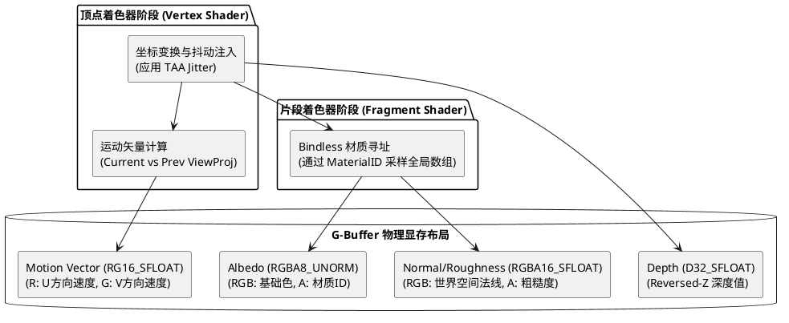
```plantuml
@startuml
skinparam componentStyle rectangle
skinparam monochrome true
skinparam shadowing false

package "顶点着色器阶段 (Vertex Shader)" {
    component "坐标变换与抖动注入\n(应用 TAA Jitter)" as VS
    component "运动矢量计算\n(Current vs Prev ViewProj)" as Motion
}

package "片段着色器阶段 (Fragment Shader)" {
    component "Bindless 材质寻址\n(通过 MaterialID 采样全局数组)" as FS
}

database "G-Buffer 物理显存布局" {
    component "Albedo (RGBA8_UNORM)\n(RGB: 基础色, A: 材质ID)" as RT0
    component "Normal/Roughness (RGBA16_SFLOAT)\n(RGB: 世界空间法线, A: 粗糙度)" as RT1
    component "Motion Vector (RG16_SFLOAT)\n(R: U方向速度, G: V方向速度)" as RT2
    component "Depth (D32_SFLOAT)\n(Reversed-Z 深度值)" as Depth
}

VS -down-> Motion
VS -down-> FS
FS -down-> RT0
FS -down-> RT1
Motion -down-> RT2
VS -down-> Depth
@enduml
```

## 38. 1-SPP 硬件光线追踪软阴影探测活动图
**建议导出文件名：** `rt_shadow_activity.png` (对应 LaTeX Label: `fig:rt_shadow`)

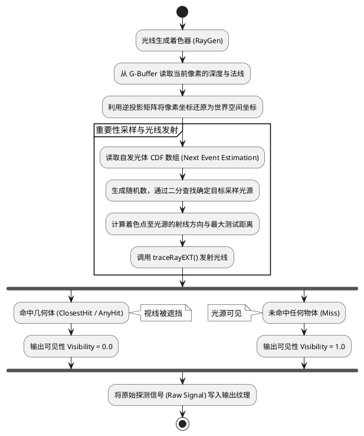
```plantuml
@startuml
skinparam monochrome true
skinparam shadowing false

start
:光线生成着色器 (RayGen);
:从 G-Buffer 读取当前像素的深度与法线;
:利用逆投影矩阵将像素坐标还原为世界空间坐标;

partition "重要性采样与光线发射" {
  :读取自发光体 CDF 数组 (Next Event Estimation);
  :生成随机数，通过二分查找确定目标采样光源;
  :计算着色点至光源的射线方向与最大测试距离;
  :调用 traceRayEXT() 发射光线;
}

fork
  :命中几何体 (ClosestHit / AnyHit);
  note right: 视线被遮挡
  :输出可见性 Visibility = 0.0;
fork again
  :未命中任何物体 (Miss);
  note left: 光源可见
  :输出可见性 Visibility = 1.0;
end fork

:将原始探测信号 (Raw Signal) 写入输出纹理;
stop
@enduml
```

## 39. 光照合成与后期处理数据流转拓扑图
**建议导出文件名：** `composition_post_flow.png` (对应 LaTeX Label: `fig:composition_post`)

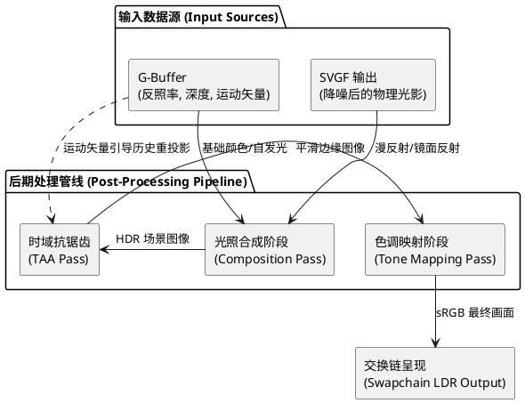
```plantuml
@startuml
skinparam componentStyle rectangle
skinparam monochrome true
skinparam shadowing false

package "输入数据源 (Input Sources)" {
    component "G-Buffer\n(反照率, 深度, 运动矢量)" as GBuffer
    component "SVGF 输出\n(降噪后的物理光影)" as SVGF
}

package "后期处理管线 (Post-Processing Pipeline)" {
    component "光照合成阶段\n(Composition Pass)" as Comp
    component "时域抗锯齿\n(TAA Pass)" as TAA
    component "色调映射阶段\n(Tone Mapping Pass)" as Post
}

component "交换链呈现\n(Swapchain LDR Output)" as Output

GBuffer -right-> Comp : 基础颜色/自发光
SVGF -down-> Comp : 漫反射/镜面反射

Comp -right-> TAA : HDR 场景图像
GBuffer .right.> TAA : 运动矢量引导历史重投影

TAA -right-> Post : 平滑边缘图像
Post -down-> Output : sRGB 最终画面
@enduml
```

## 15. 参数动态调节顺序图
**建议导出文件名：** `param_adjustment_sequence.png` (对应 LaTeX Label: `fig:param_sequence`)

```plantuml
@startuml
skinparam backgroundColor white
actor "用户" as User
participant "UI" as UI
participant "Context" as Context
participant "UBO" as UBO
participant "Shader" as Shader

User -> UI : 调节参数滑块
UI -> Context : 更新字段值
UI -> Context : 设置 Dirty 标记

loop 帧循环
    Context -> UBO : 数据写入 (Mapping)
    UBO -> Shader : 绑定描述符集
    Shader -> Shader : 应用新参数计算
end
@enduml
```

---
## 16. 系统渲染数据流图 (DFD)
**建议导出文件名：** `render_dfd_refined.png` (对应 LaTeX Label: `fig:render_dfd`)

```plantuml
@startuml
skinparam backgroundColor white
skinparam shadowing false
skinparam linetype ortho

skinparam usecase {
    BackgroundColor White
    BorderColor Black
}
skinparam collections {
    BackgroundColor White
    BorderColor Black
}

node "磁盘资产" as Disk
node "显示器" as Monitor

usecase "资产解析与转换" as P1
usecase "RenderGraph 编译" as P2
usecase "GPU 渲染执行" as P3

collections "元数据存储" as RAM
collections "显存资源池" as VRAM

Disk --> P1
P1 --> RAM
RAM --> P1
P1 --> VRAM

VRAM --> P2
P2 --> P3

VRAM <--> P3
P3 --> Monitor
@enduml
```

---
## 17. 混合管线执行时序图
**建议导出文件名：** `hybrid_pipeline_sequence.png` (对应 LaTeX Label: `fig:hybrid_sequence`)

```plantuml
@startuml
skinparam backgroundColor white
skinparam shadowing false
skinparam sequenceMessageAlign center

participant "RenderGraph" as RG
participant "GBuffer" as GB
participant "RT_Pass" as RT
participant "SVGF" as SVGF
participant "PBR_Comp" as Comp
participant "TAA" as TAA
participant "Post" as Post
participant "GPU" as GPU

RG -> GB : 1. 几何采集
activate GB
GB -> GPU : 写入 G-Buffer
GB --> RG 
deactivate GB

RG -> RT : 2. 射线查询
activate RT
RT -> GPU : 硬件光追探测
RT --> RG 
deactivate RT

RG -> SVGF : 3. 时空降噪
activate SVGF
SVGF -> GPU : 多级 À-Trous 滤波
SVGF --> RG 
deactivate SVGF

RG -> Comp : 4. 能量合成
activate Comp
Comp -> GPU : 物理着色
Comp --> RG 
deactivate Comp

RG -> TAA : 5. 抗锯齿
activate TAA
TAA -> GPU : 亚像素重建
TAA --> RG 
deactivate TAA

RG -> Post : 6. 后期处理
activate Post
Post -> GPU : 色调映射
Post --> GPU : 写入交换链
deactivate Post
@enduml
```

---
## 18. Walnut 框架组件架构图
**建议导出文件名：** `walnut_architecture.png` (对应 LaTeX Label: `fig:walnut_architecture`)

```plantuml
@startuml
skinparam packageStyle rectangle
skinparam componentStyle uml2
skinparam linetype ortho
skinparam nodesep 50
skinparam ranksep 40

' 定义样式，使其更适合论文排版
skinparam rectangle {
    BackgroundColor White
    BorderColor #333333
    RoundCorner 10
}
skinparam component {
    BackgroundColor #F8F9FA
    BorderColor #666666
}

package "用户业务层 (User Business Layer)" as LayerUser {
    component "渲染逻辑层\n(Renderer Layer)" as Renderer
    component "交互调试层\n(Editor UI Layer)" as UI
}

package "Walnut 核心框架层 (Core Framework Layer)" as LayerCore {
    component "应用全局中枢\n(Application Singleton)" as App
    component "层叠堆栈管理器\n(Layer Stack Manager)" as Stack
    component "事件分发系统\n(Event System)" as Event
}

package "平台与图形抽象层 (Platform Abstraction Layer)" as LayerPlatform {
    component "图形上下文封装\n(Vulkan Context)" as VK
    component "窗口与输入系统\n(GLFW Window)" as Window
}

' 核心驱动逻辑
App -down-> Stack : "1. 帧循环驱动 (Frame Loop)"
App -down-> Window : "管理系统生命周期"
App -down-> VK : "初始化硬件环境"
Window -up-> Event : "捕获底层系统事件"

' 堆栈调度逻辑
Stack -up-> Renderer : "2. 触发 OnUpdate / OnRender"
Stack -up-> UI : "3. 触发 OnImGuiRender"
Event -up-> LayerUser : "路由鼠标/键盘事件"

' 底层调用逻辑
Renderer ..> VK : "提交渲染指令"
UI ..> VK : "提交 UI 顶点"

@enduml
```

---
## 19. 混合渲染管线数据流转图
**建议导出文件名：** `hybrid_pipeline_flow.png` (对应 LaTeX Label: `fig:hybrid_flow`)

```plantuml
@startuml
skinparam packageStyle rectangle
skinparam componentStyle uml2
skinparam linetype ortho
skinparam nodesep 40
skinparam ranksep 30

skinparam rectangle {
    BackgroundColor White
    BorderColor #333333
    RoundCorner 10
}
skinparam component {
    BackgroundColor #F8F9FA
    BorderColor #666666
}
skinparam artifact {
    BackgroundColor #E8F4F8
    BorderColor #2980B9
}

package "混合渲染管线 (Hybrid Rendering Pipeline)" {

    component "1. 几何采集阶段\n(Rasterization)" as PassGBuffer
    
    artifact "G-Buffer 几何缓冲区" as GBuffer {
        file "基础反照率\n(Albedo)" as RT_Albedo
        file "材质属性\n(Metallic/Roughness)" as RT_Material
        file "世界空间法线\n(World Normal)" as RT_Normal
        file "屏幕运动矢量\n(Motion Vectors)" as RT_Motion
        file "线性深度缓冲\n(Linear Depth)" as RT_Depth
    }

    component "2. 物理光追着色阶段\n(Hardware Ray Tracing)" as PassRT
    
    artifact "原始光影信号\n(Noisy Irradiance 1 SPP)" as RTOutput
    
    component "3. 时空降噪重构阶段\n(SVGF Denoising)" as PassSVGF
    
    artifact "平滑辐照度\n(Clean Irradiance)" as CleanOutput
    
    component "4. 延迟合成与后期阶段\n(Composition & Post)" as PassPost

    artifact "最终呈现画面\n(Swapchain Image)" as FinalImage
}

' 数据流向控制
PassGBuffer -down-> GBuffer : "多目标渲染 (MRT) 提取"

GBuffer -down-> PassRT : "读取法线、深度重建坐标"
PassRT -down-> RTOutput : "发射射线，输出带噪辐照度"

RTOutput -down-> PassSVGF : "输入高频噪声信号"
GBuffer -right-> PassSVGF : "提供运动历史与几何边界引导"

PassSVGF -down-> CleanOutput : "输出时空滤波结果"

CleanOutput -down-> PassPost : "输入纯净光影"
RT_Albedo -down-> PassPost : "结合基础色 (Albedo)"
RT_Material -down-> PassPost : "结合物理材质计算"

PassPost -down-> FinalImage : "色调映射与抗锯齿处理"

@enduml
```

---
## 20. Vulkan 图形上下文初始化时序图
**建议导出文件名：** `vulkan_init_sequence.png` (对应 LaTeX Label: `fig:vulkan_init_sequence`)

```plantuml
@startuml
skinparam sequence {
    ParticipantPadding 20
    BoxPadding 10
    LifeLineBorderColor #555555
    LifeLineBackgroundColor #FFFFFF
}

actor "EngineApp" as App
participant "VulkanContext" as Context
participant "GLFW" as GLFW
participant "volk" as Volk
participant "Vulkan API" as API

activate App
App -> Context : Initialize()
activate Context

== 阶段 1：全局基础指针加载 ==

Context -> Volk : volkInitialize()
activate Volk
Volk --> Context : Success
deactivate Volk

Context -> API : vkCreateInstance()
activate API
API --> Context : VkInstance
deactivate API

Context -> Volk : volkLoadInstance()
activate Volk
Volk --> Context : Success
deactivate Volk

== 阶段 2：平台适配与硬件寻址 ==

Context -> GLFW : glfwCreateWindowSurface()
activate GLFW
GLFW --> Context : VkSurfaceKHR
deactivate GLFW

Context -> API : vkEnumeratePhysicalDevices()
activate API
API --> Context : VkPhysicalDevice
deactivate API

== 阶段 3：特性链注入与设备创建 ==

note over Context : 组装光追特性链\n(pNext Chaining)

Context -> API : vkCreateDevice()
activate API
API --> Context : VkDevice
deactivate API

Context -> Volk : volkLoadDevice()
activate Volk
Volk --> Context : Success
deactivate Volk

Context -> API : CreateSwapchain(Mailbox)
activate API
API --> Context : VkSwapchainKHR
deactivate API

Context --> App : Ready
deactivate Context

@enduml
```

---
## 22. 混合渲染管线宏观概念流转图
**建议导出文件名：** `hybrid_pipeline_macro_flow.png` (对应 LaTeX Label: `fig:hybrid_macro_flow`)

```plantuml
@startuml
skinparam defaultTextAlignment center
skinparam rectangle {
    BackgroundColor #F8F9FA
    BorderColor #333333
    RoundCorner 8
}
skinparam arrow {
    Color #666666
}

rectangle "三维场景数据\n(Scene Data)" as Input

rectangle "第一阶段：几何特征采集\n(Geometry Pass)" as Phase1
rectangle "第二阶段：物理光影计算\n(Ray Tracing Pass)" as Phase2
rectangle "第三阶段：时空信号重建\n(Denoising Pass)" as Phase3
rectangle "第四阶段：光照合成与后期\n(Composition & Post)" as Phase4

rectangle "最终二维画面\n(Final Image)" as Output

Input -down-> Phase1
Phase1 -down-> Phase2 : "提供屏幕空间可见性与材质属性"
Phase2 -down-> Phase3 : "输出存在统计学噪声的原始光影"
Phase1 -right-> Phase3 : "提供几何边界与运动轨迹约束"
Phase3 -down-> Phase4 : "输出平滑纯净的间接光照"
Phase1 -right-> Phase4 : "提供基础反照率 (Albedo)"
Phase4 -down-> Output
@enduml
```

---
## 21. 资产解析与光追加速结构流转架构图
**建议导出文件名：** `async_loading_sequence_refined.png` (对应 LaTeX Label: `fig:loading_sequence_refined`)

```plantuml
@startuml
skinparam defaultTextAlignment center
skinparam componentStyle uml2
skinparam linetype ortho
skinparam nodesep 40
skinparam ranksep 40

package "磁盘存储系统 (Disk)" {
    [GLTF 场景文件\n(.gltf / .bin)] as GLTF
    [PBR 贴图资产\n(.png / .jpg)] as Textures
}

package "主机内存空间 (RAM - 异步流式加载)" {
    [JSON 语义解析器] as Parser
    [暂存缓冲区\n(Staging Buffer)] as Staging
}

package "显卡物理显存 (VRAM - 渲染使用)" {
    [几何数据缓冲\n(VBO / IBO)] as VBO
    [优化显存纹理\n(Optimal Tiling Image)] as Image
}

package "光追硬件单元 (RT Core)" {
    [底层加速结构\n(BLAS)] as BLAS
    [顶层加速结构\n(TLAS)] as TLAS
}

GLTF -down-> Parser : 提交至后台任务队列
Textures -down-> Staging : 多线程图像解码
Parser -down-> Staging : 顶点/索引/材质打包

Staging -down-> VBO : DMA 异步传输
Staging -down-> Image : DMA 异步传输

VBO -down-> BLAS : 预计算：提取空间包围盒
---
## 23. 图形后端静态组件拓扑图
**建议导出文件名：** `backend_component_topology.png` (对应 LaTeX Label: `fig:backend_topology`)

```plantuml
@startuml
skinparam componentStyle rectangle
skinparam monochrome true
skinparam shadowing false

package "图形硬件后端模块 (Graphics Backend)" {
    [**VulkanContext**\n全局上下文总控] as Context
    
    [**VulkanDevice**\n物理与逻辑设备] as Device
    [**VMA Allocator**\n显存亚分配中心] as VMA
    [**Swapchain**\n交换链与多重缓冲] as Swapchain
    [**DeletionQueue**\n帧感知销毁队列] as DelQueue
    [**Thread-Local Pools**\n多线程指令池] as CmdPools
    
    Context ---> Device : 管理设备生命周期
    Context ---> Swapchain : 呈现队列调度
    Context ---> DelQueue : 调度帧回收
    Context ---> CmdPools : 基于 ThreadID 派发
    
    Device *-- VMA : 封装 vkAllocateMemory
}

interface "混合渲染管线 (上层业务)" as API
API -down-> Context : 申请 CommandBuffer\n获取 DescriptorLayout

@enduml
```

## 24. 物理特性按需注入机制时序图
**建议导出文件名：** `vulkan_feature_injection.png` (对应 LaTeX Label: `fig:feature_injection`)

```plantuml
@startuml
skinparam monochrome true
skinparam shadowing false

actor Engine
participant VulkanDevice
participant "Vulkan API" as VK

Engine -> VulkanDevice : CreateLogicalDevice()
activate VulkanDevice

VulkanDevice -> VK : vkEnumerateDeviceExtensionProperties()
VK --> VulkanDevice : 返回可用扩展列表

alt 如果硬件支持光线追踪
    VulkanDevice -> VulkanDevice : 构建 RayTracingPipelineFeaturesKHR
    VulkanDevice -> VulkanDevice : 构建 AccelerationStructureFeaturesKHR
    VulkanDevice -> VulkanDevice : 构建 RayQueryFeaturesKHR
    Note right of VulkanDevice : 通过 pNext 链表串联上述光追特性
end

VulkanDevice -> VulkanDevice : 构建 Vulkan12Features (开启 Bindless)
VulkanDevice -> VulkanDevice : 构建 Vulkan13Features (开启 Dynamic Rendering)

Note over VulkanDevice : 将 Vulkan12/13 基础特性与光追特性链表合并

VulkanDevice -> VK : vkCreateDevice(pCreateInfo)
VK --> VulkanDevice : 返回 LogicalDevice 句柄

deactivate VulkanDevice
@enduml
```

## 25. 帧感知延迟销毁队列时序图
**建议导出文件名：** `deletion_queue_sequence.png` (对应 LaTeX Label: `fig:deletion_sequence`)

```plantuml
@startuml
skinparam monochrome true
skinparam shadowing false

participant "逻辑业务层" as Logic
participant "DeletionQueue" as Queue
participant "渲染主循环" as Loop
participant "GPU 硬件" as GPU

Logic -> Queue : 销毁物理资产 (PushFunction, Frame Index: N)
Note right of Queue : 匿名闭包被压入第 N 帧的等待队列\n(此时不发生实际显存释放)

Loop -> Loop : CPU 完成第 N 帧指令录制
Loop -> GPU : vkQueueSubmit()
GPU -> GPU : 异步执行第 N 帧渲染任务

... 若干帧流转后 ...

Loop -> GPU : vkWaitForFences()
Note right of Loop : 阻塞 CPU，确认 GPU 已完整执行完第 N 帧指令

GPU --> Loop : 信号释放 (Frame N 完毕)
Loop -> Queue : FlushFrame(Frame Index: N)
activate Queue
Queue -> Queue : 逆序执行闭包回调 (LIFO)
Queue -> "显存池(VMA)" : 安全执行实际的显存释放
deactivate Queue
@enduml
```

---
## 26. 资源管理无绑定 (Bindless) 组件拓扑图
**建议导出文件名：** `resource_bindless_topology.png` (对应 LaTeX Label: `fig:resource_bindless`)

```plantuml
@startuml
skinparam componentStyle rectangle
skinparam monochrome true
skinparam shadowing false

package "资源管理模块 (Resource Layer)" {
    component "AssetImporter\n(基于 Assimp 的资产解析)" as Importer
    component "ResourceManager\n(全局资源流转总控)" as RM
    component "ResourceRef<T>\n(Type-Safe 智能句柄)" as Handle
    component "Bindless Descriptor Set\n(Set 1: 全局材质与纹理)" as Bindless
}

database "GPU 显存 (Vulkan Device Memory)" {
    component "Global Texture Array\n(sampler2D textures[ ])" as TexArray
    component "Global Material Buffer\n(SSBO materials[ ])" as MatBuffer
}

Importer -right-> RM : 提交剥离后的\n顶点/法线/贴图
RM -down-> Bindless : vkUpdateDescriptorSets\n(仅更新特定索引)
RM -left-> Handle : 封装并派发安全句柄

Bindless ..> TexArray : 硬件层映射
Bindless ..> MatBuffer : 硬件层映射
@enduml
```

## 27. 基于引用计数的异步资产安全生命周期时序图
**建议导出文件名：** `resource_async_lifecycle.png` (对应 LaTeX Label: `fig:resource_lifecycle`)

```plantuml
@startuml
skinparam monochrome true
skinparam shadowing false

participant "逻辑业务层" as Logic
participant "异步任务系统" as Async
participant "ResourceManager" as RM
participant "ResourceRef<T>" as Ref
participant "帧感知销毁队列" as Queue

Logic -> Async : 发起 glTF 异步加载请求
activate Async
Async -> RM : 解析完毕，申请 VMA 显存空间
RM --> Async : 返回底层句柄 Handle<T>
Async --> Logic : 返回包裹对象 ResourceRef<T>\n(初始引用计数为 1)
deactivate Async

Note over Logic, Ref : 渲染系统持有资产句柄进行常规渲染...

Logic -> Ref : 实体剔除或场景卸载\n(触发 ResourceRef 析构)
activate Ref
Ref -> RM : 触发 ReleaseInternal()
RM -> RM : 对应资源的引用计数减至 0
RM -> Queue : 推入延迟销毁闭包\nPushFunction(FrameIndex, Lambda)
deactivate Ref

Note over Queue : 等待 GPU 跨越当前帧边界后\n安全释放物理显存
@enduml
```

## 28. 场景自发光体解析与 CDF 预建活动图
**建议导出文件名：** `light_cdf_preprocessing.png` (对应 LaTeX Label: `fig:light_cdf`)

```plantuml
@startuml
skinparam monochrome true
skinparam shadowing false

start
:触发光照更新事件;
:解析当前场景层级结构;
:遍历实体及其网格数据;

if (网格是否包含自发光材质?) then (是)
  :计算三角面片的世界空间面积;
  :计算辐射通量\n(通量 = 面积 × 发光强度);
  :将计算结果累加至\n累计分布函数 (CDF) 数组;
  :记录光源实例的映射关系;
else (否)
endif

:完成全场景光源参数评估;
:构建 GPU 侧线性结构体数组;
:映射暂存显存 (Staging Buffer);
:同步更新设备端 LightBuffer 与 CDFBuffer;
stop
@enduml
```

---
## 29. 混合光追双层加速结构 (AS) 分级构建架构图
**建议导出文件名：** `as_graded_construction.png` (对应 LaTeX Label: `fig:as_construction`)

```plantuml
@startuml
skinparam componentStyle rectangle
skinparam monochrome true
skinparam shadowing false

package "资源层 (Resource Layer)" {
    component "Model 对象 (静态资产)" as Model
    component "底层加速结构\n(BLAS: 封装顶点与三角形)" as BLAS
    Model --> BLAS : 初始化时构建 (BuildBLAS)
}

package "场景逻辑层 (Scene Layer)" {
    component "Entity (场景实体)" as Entity
    component "场景变换矩阵\n(Transform / Matrix)" as TRS
    Entity o-- Model : 引用共享模型
    Entity *-- TRS : 独立空间位置
}

package "图形驱动层 (Vulkan API)" {
    component "加速结构实例缓冲\n(AS Instance Buffer)" as InstanceBuffer
    component "顶层加速结构\n(TLAS: 封装场景图)" as TLAS
}

Entity --> InstanceBuffer : 每帧将 TRS 与 BLAS 地址写入
InstanceBuffer --> TLAS : 触发 vkCmdBuildAccelerationStructuresKHR
TLAS ..> BLAS : 硬件级指针关联 (Device Address)

@enduml
```

## 30. 摄像机时域抖动注入与历史矩阵追踪时序图
**建议导出文件名：** `camera_jitter_sequence.png` (对应 LaTeX Label: `fig:camera_temporal`)

```plantuml
@startuml
skinparam monochrome true
skinparam shadowing false

participant "主渲染循环" as Loop
participant "EditorCamera" as Camera
participant "渲染管线" as Pipeline

Loop -> Camera : 开始新一帧 (Frame Index = N)
activate Camera

Camera -> Camera : 记录当前 View / Proj 矩阵\n将其备份为 PrevView / PrevProj
Note right of Camera : 保存历史状态，用于\n计算当前帧的运动矢量

alt 如果 TAA 开启
    Camera -> Camera : 根据 Frame Index 生成\nHalton 序列随机分布点
    Camera -> Camera : 计算亚像素偏移量 (Jitter X/Y)
    Camera -> Camera : 修改投影矩阵 [0][2] 和 [1][2] 分量
    Note right of Camera : 强行使屏幕像素发生微小偏移\n以实现超采样累积
end

Camera --> Loop : 返回包含 Jitter 的当前 Projection 矩阵
deactivate Camera

Loop -> Pipeline : 派发 G-Buffer Pass
activate Pipeline
Pipeline -> Pipeline : 顶点着色器执行
Note right of Pipeline : 利用 Camera.PrevViewProj\n与当前 ViewProj 计算屏幕空间差值\n输出至 Motion Vector 纹理
deactivate Pipeline
@enduml
```

---
## 31. RenderGraph 资源依赖与任务编排组件设计图
**建议导出文件名：** `render_graph_component_design.png` (对应 LaTeX Label: `fig:rg_component`)

```plantuml
@startuml
skinparam componentStyle rectangle
skinparam monochrome true
skinparam shadowing false

package "渲染调度模块 (Function Layer)" {
    component "RenderGraph\n(全局图调度器)" as RG
    component "PassBuilder\n(Pass 声明接口)" as Builder
    component "RenderGraphPass\n(任务节点)" as Pass
    component "PhysicalResource\n(物理资源托管)" as Res
    component "ImagePool\n(显存复用池)" as Pool
}

Pass -up-> Builder : 调用声明接口
Builder -down-> RG : 注册资源读写意图\n(Read/Write/History)
RG -right-> Res : 建立逻辑与物理资源映射
RG -down-> Pool : 申请与回收物理显存

interface "具体渲染通道\n(GBuffer/RT/SVGF...)" as Passes
Passes -down-> Pass : 实现任务逻辑
@enduml
```

## 32. 资源状态自动机与同步屏障自动生成活动图
**建议导出文件名：** `auto_barrier_logic_flow.png` (对应 LaTeX Label: `fig:barrier_logic`)

```plantuml
@startuml
skinparam monochrome true
skinparam shadowing false

start
:每一帧渲染开始;
:执行 Setup 阶段 (注册并收集所有 Pass);
:执行 Compile 阶段;
partition "自动同步推导逻辑" {
  :根据资源用途 (ResourceUsage) 映射目标状态;
  :遍历 Pass 执行序列;
  if (当前资源状态 != 目标所需状态?) then (是)
    :计算源状态与目标状态的掩码信息;
    :生成并插入 vkCmdPipelineBarrier2 指令;
    :更新资源当前的全局状态记录;
  else (否)
  endif
}
:执行 Execute 阶段 (录制指令并提交队列);
:执行资源生命周期更新与清理;
stop
@enduml
```

