# 本渲染引擎设计图体系 (PlantUML)

本文件存储了本渲染引擎在需求分析与概要设计阶段对应的所有用例图、类图及架构图代码。

---
# 第一部分：用例图 (需求分析)

## 1. 场景与资产管理用例图
**建议导出文件名：** `scene_management_usecase.png` (对应 LaTeX Label: `fig:scene_usecase`)

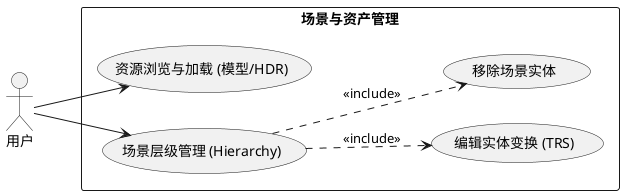
```plantuml
@startuml
left to right direction
skinparam packageStyle rectangle

actor "用户" as User

rectangle "场景与资产管理" {
    usecase "资源浏览与加载 (模型/HDR)" as UC1
    usecase "场景层级管理 (Hierarchy)" as UC2
    usecase "编辑实体变换 (TRS)" as UC4
    usecase "移除场景实体" as UC5
}

User --> UC1
User --> UC2

UC2 ..> UC4 : <<include>>
UC2 ..> UC5 : <<include>>
@enduml

```

## 2. Debug UI 交互用例图
**建议导出文件名：** `rendering_control_usecase.png` (对应 LaTeX Label: `fig:pipeline_usecase`)

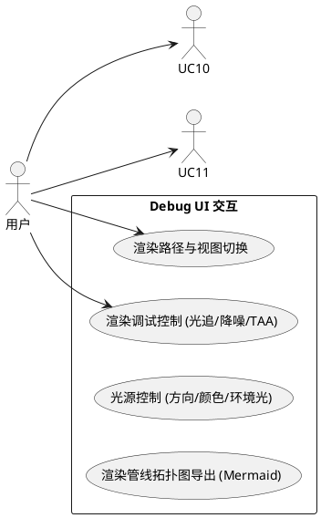
```plantuml
@startuml
left to right direction
skinparam packageStyle rectangle

actor "用户" as User

rectangle "Debug UI 交互" {
    usecase "渲染路径与视图切换" as UC6
    usecase "渲染调试控制 (光追/降噪/TAA)" as UC7
    usecase "光源控制 (方向/颜色/环境光)" as UC8
    usecase "渲染管线拓扑图导出 (Mermaid)" as UC9
}

User --> UC6
User --> UC7
User --> UC10
User --> UC11

@enduml
```

## 3. 场景交互与观察用例图
**建议导出文件名：** `visualization_debug_usecase.png` (对应 LaTeX Label: `fig:debug_usecase`)

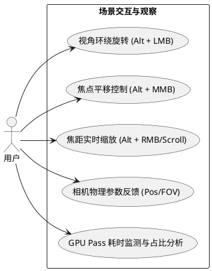
```plantuml
@startuml
left to right direction
skinparam packageStyle rectangle

actor "用户" as User

rectangle "场景交互与观察" {
    usecase "视角环绕旋转 (Alt + LMB)" as UC10
    usecase "焦点平移控制 (Alt + MMB)" as UC11
    usecase "焦距实时缩放 (Alt + RMB/Scroll)" as UC12
    usecase "相机物理参数反馈 (Pos/FOV)" as UC13
    usecase "GPU Pass 耗时监测与占比分析" as UC14
}

User --> UC10
User --> UC11
User --> UC12
User --> UC13
User --> UC14

@enduml
```

---
# 第二部分：类图 (概要设计)

## 4. 全局管理与分层框架类图
**建议导出文件名：** `framework_class_diagram.png` (对应 LaTeX Label: `fig:framework_class_diagram`)

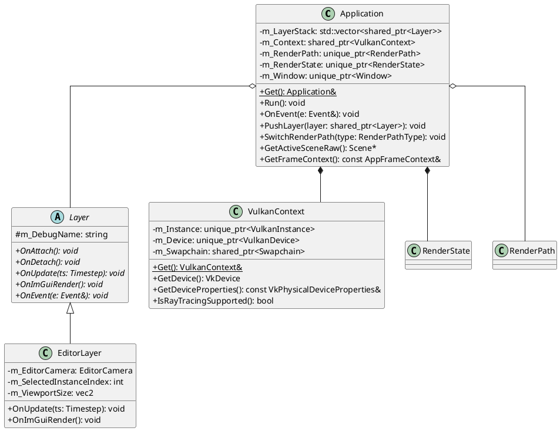
```plantuml
@startuml
skinparam classAttributeIconSize 0
skinparam linetype ortho

class Application {
    - m_LayerStack: std::vector<shared_ptr<Layer>>
    - m_Context: shared_ptr<VulkanContext>
    - m_RenderPath: unique_ptr<RenderPath>
    - m_RenderState: unique_ptr<RenderState>
    - m_Window: unique_ptr<Window>
    + {static} Get(): Application&
    + Run(): void
    + OnEvent(e: Event&): void
    + PushLayer(layer: shared_ptr<Layer>): void
    + SwitchRenderPath(type: RenderPathType): void
    + GetActiveSceneRaw(): Scene*
    + GetFrameContext(): const AppFrameContext&
}

abstract class Layer {
    # m_DebugName: string
    + {abstract} OnAttach(): void
    + {abstract} OnDetach(): void
    + {abstract} OnUpdate(ts: Timestep): void
    + {abstract} OnImGuiRender(): void
    + {abstract} OnEvent(e: Event&): void
}

class EditorLayer {
    - m_EditorCamera: EditorCamera
    - m_SelectedInstanceIndex: int
    - m_ViewportSize: vec2
    + OnUpdate(ts: Timestep): void
    + OnImGuiRender(): void
}

class VulkanContext {
    - m_Instance: unique_ptr<VulkanInstance>
    - m_Device: unique_ptr<VulkanDevice>
    - m_Swapchain: shared_ptr<Swapchain>
    + {static} Get(): VulkanContext&
    + GetDevice(): VkDevice
    + GetDeviceProperties(): const VkPhysicalDeviceProperties&
    + IsRayTracingSupported(): bool
}

' Relationships
Application o-- Layer
Application *-- VulkanContext
Application *-- RenderState
Application o-- RenderPath
Layer <|-- EditorLayer
@enduml
```

## 5. 资源管理与场景组织类图
**建议导出文件名：** `resource_scene_class_diagram.png` (对应 LaTeX Label: `fig:resource_scene_class_diagram`)

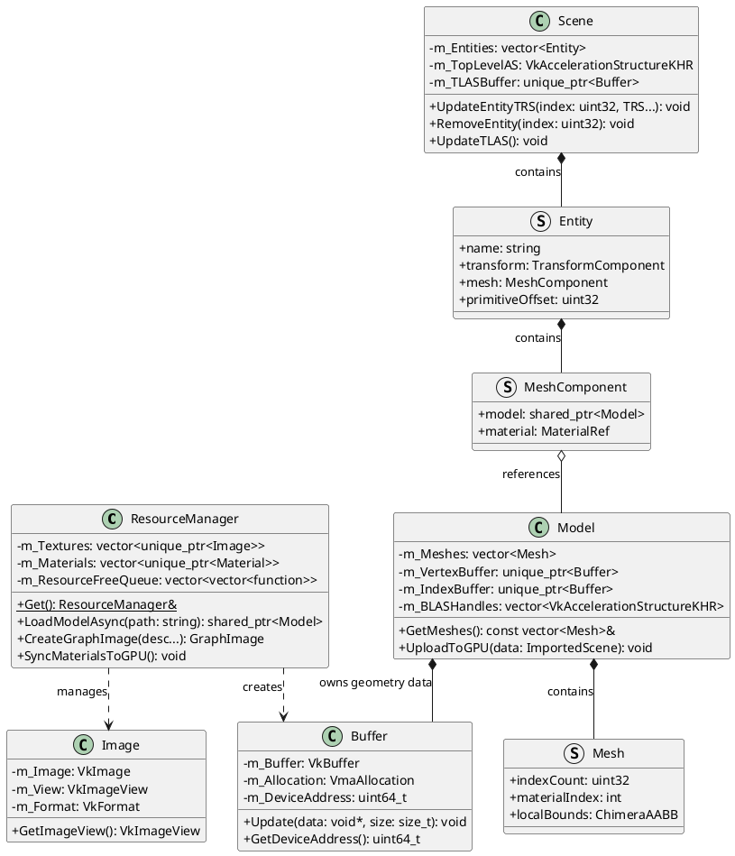
```plantuml
@startuml
skinparam classAttributeIconSize 0
skinparam linetype ortho

' --- 资源层 ---
class ResourceManager {
    - m_Textures: vector<unique_ptr<Image>>
    - m_Materials: vector<unique_ptr<Material>>
    - m_ResourceFreeQueue: vector<vector<function>>
    + {static} Get(): ResourceManager&
    + LoadModelAsync(path: string): shared_ptr<Model>
    + CreateGraphImage(desc...): GraphImage
    + SyncMaterialsToGPU(): void
}

class Buffer {
    - m_Buffer: VkBuffer
    - m_Allocation: VmaAllocation
    - m_DeviceAddress: uint64_t
    + Update(data: void*, size: size_t): void
    + GetDeviceAddress(): uint64_t
}

class Image {
    - m_Image: VkImage
    - m_View: VkImageView
    - m_Format: VkFormat
    + GetImageView(): VkImageView
}

' --- 场景层 ---
class Scene {
    - m_Entities: vector<Entity>
    - m_TopLevelAS: VkAccelerationStructureKHR
    - m_TLASBuffer: unique_ptr<Buffer>
    + UpdateEntityTRS(index: uint32, TRS...): void
    + RemoveEntity(index: uint32): void
    + UpdateTLAS(): void
}

struct Entity {
    + name: string
    + transform: TransformComponent
    + mesh: MeshComponent
    + primitiveOffset: uint32
}

struct MeshComponent {
    + model: shared_ptr<Model>
    + material: MaterialRef
}

class Model {
    - m_Meshes: vector<Mesh>
    - m_VertexBuffer: unique_ptr<Buffer>
    - m_IndexBuffer: unique_ptr<Buffer>
    - m_BLASHandles: vector<VkAccelerationStructureKHR>
    + GetMeshes(): const vector<Mesh>&
    + UploadToGPU(data: ImportedScene): void
}

struct Mesh {
    + indexCount: uint32
    + materialIndex: int
    + localBounds: ChimeraAABB
}

' --- 关系 ---
ResourceManager ..> Buffer : "creates"
ResourceManager ..> Image : "manages"

Scene *-- Entity : "contains"
Entity *-- MeshComponent : "contains"
MeshComponent o-- Model : "references"
Model *-- Mesh : "contains"
Model *-- Buffer : "owns geometry data"

@enduml
```

## 6. RenderGraph 调度引擎类图
**建议导出文件名：** `rendergraph_engine_class_diagram.png` (对应 LaTeX Label: `fig:rendergraph_engine_class_diagram`)

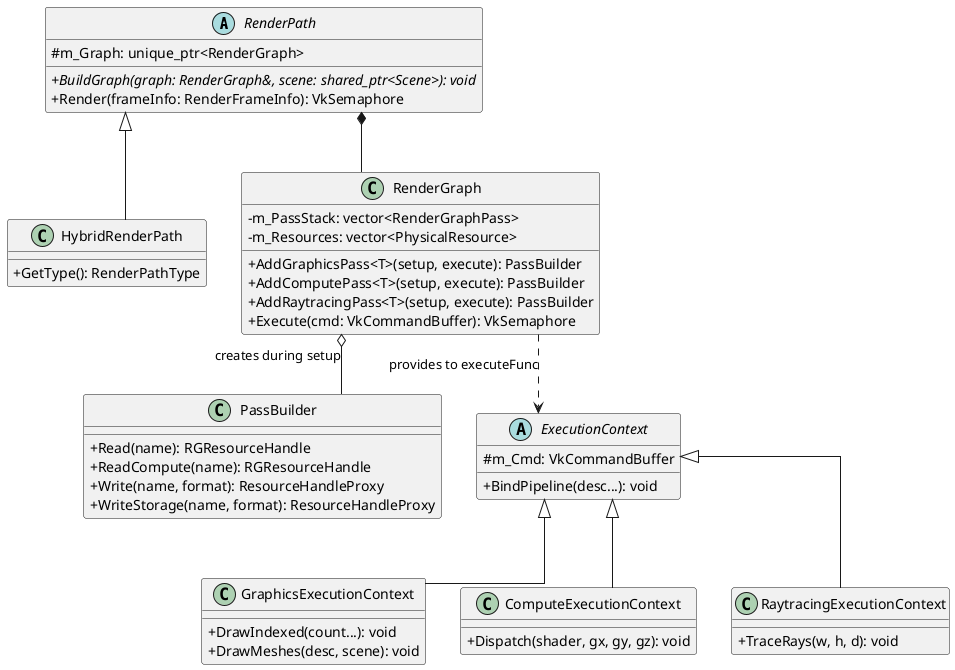
```plantuml
@startuml
skinparam classAttributeIconSize 0
skinparam linetype ortho

' --- 1. Orchestration ---
abstract class RenderPath {
    # m_Graph: unique_ptr<RenderGraph>
    + {abstract} BuildGraph(graph: RenderGraph&, scene: shared_ptr<Scene>): void
    + Render(frameInfo: RenderFrameInfo): VkSemaphore
}

class HybridRenderPath {
    + GetType(): RenderPathType
}

class RenderGraph {
    - m_PassStack: vector<RenderGraphPass>
    - m_Resources: vector<PhysicalResource>
    + AddGraphicsPass<T>(setup, execute): PassBuilder
    + AddComputePass<T>(setup, execute): PassBuilder
    + AddRaytracingPass<T>(setup, execute): PassBuilder
    + Execute(cmd: VkCommandBuffer): VkSemaphore
}

' --- 2. Pass Builder & Hierarchy ---
class PassBuilder {
    + Read(name): RGResourceHandle
    + ReadCompute(name): RGResourceHandle
    + Write(name, format): ResourceHandleProxy
    + WriteStorage(name, format): ResourceHandleProxy
}

abstract class ExecutionContext {
    # m_Cmd: VkCommandBuffer
    + BindPipeline(desc...): void
}

class GraphicsExecutionContext {
    + DrawIndexed(count...): void
    + DrawMeshes(desc, scene): void
}

class ComputeExecutionContext {
    + Dispatch(shader, gx, gy, gz): void
}

class RaytracingExecutionContext {
    + TraceRays(w, h, d): void
}

' --- Relationships ---
RenderPath <|-- HybridRenderPath
RenderPath *-- RenderGraph

RenderGraph o-- PassBuilder : "creates during setup"
RenderGraph ..> ExecutionContext : "provides to executeFunc"

ExecutionContext <|-- GraphicsExecutionContext
ExecutionContext <|-- ComputeExecutionContext
ExecutionContext <|-- RaytracingExecutionContext

@enduml
```

---
# 第三部分：系统架构图

## 7. 五层分层拓扑架构图
**建议导出文件名：** `renderer_architecture.png` (对应 LaTeX Label: `fig:renderer_architecture`)

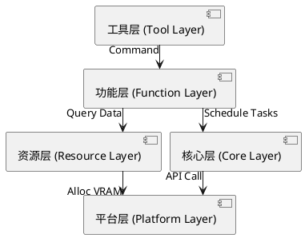
```plantuml
@startuml
skinparam packageStyle rectangle
skinparam linetype ortho
skinparam nodesep 10
skinparam ranksep 30

' 严格的上下层依赖关系
[工具层 (Tool Layer)] --> [功能层 (Function Layer)] : "Command"
[功能层 (Function Layer)] --> [资源层 (Resource Layer)] : "Query Data"
[功能层 (Function Layer)] --> [核心层 (Core Layer)] : "Schedule Tasks"
[资源层 (Resource Layer)] --> [平台层 (Platform Layer)] : "Alloc VRAM"
[核心层 (Core Layer)] --> [平台层 (Platform Layer)] : "API Call"

@enduml
```

---
## 8. 系统渲染数据流图 (DFD)
**建议导出文件名：** `render_dfd.png` (对应 LaTeX Label: `fig:render_dfd`)

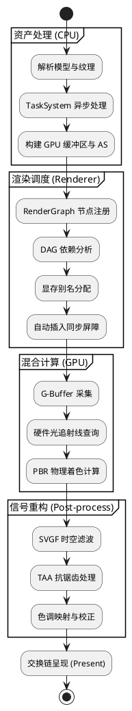
```plantuml
@startuml
skinparam backgroundColor white
skinparam shadowing false

start

partition "资产处理 (CPU)" {
    :解析模型与纹理;
    :TaskSystem 异步处理;
    :构建 GPU 缓冲区与 AS;
}

partition "渲染调度 (Renderer)" {
    :RenderGraph 节点注册;
    :DAG 依赖分析;
    :显存别名分配;
    :自动插入同步屏障;
}

partition "混合计算 (GPU)" {
    :G-Buffer 采集;
    :硬件光追射线查询;
    :PBR 物理着色计算;
}

partition "信号重构 (Post-process)" {
    :SVGF 时空滤波;
    :TAA 抗锯齿处理;
    :色调映射与校正;
}

:交换链呈现 (Present);

stop
@enduml
```

---
## 11. SVGF 降噪管线流程图
**建议导出文件名：** `svgf_pipeline_data_flow.png` (对应 LaTeX Label: `fig:svgf_pipeline`)

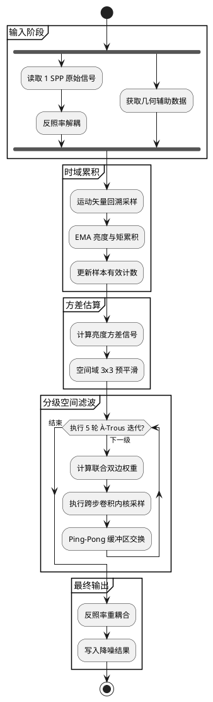
```plantuml
@startuml
skinparam backgroundColor white
skinparam shadowing false

start

partition "输入阶段" {
    fork
        :读取 1 SPP 原始信号;
        :反照率解耦;
    fork again
        :获取几何辅助数据;
    end fork
}

partition "时域累积" {
    :运动矢量回溯采样;
    :EMA 亮度与矩累积;
    :更新样本有效计数;
}

partition "方差估算" {
    :计算亮度方差信号;
    :空间域 3x3 预平滑;
}

partition "分级空间滤波" {
    while (执行 5 轮 À-Trous 迭代?) is (下一级)
        :计算联合双边权重;
        :执行跨步卷积内核采样;
        :Ping-Pong 缓冲区交换;
    endwhile (结束)
}

partition "最终输出" {
    :反照率重耦合;
    :写入降噪结果;
}

stop
@enduml
```

---
## 10. 时域历史持久化机制图
**建议导出文件名：** `history_persistent_mechanism.png` (对应 LaTeX Label: `fig:history_mechanism`)

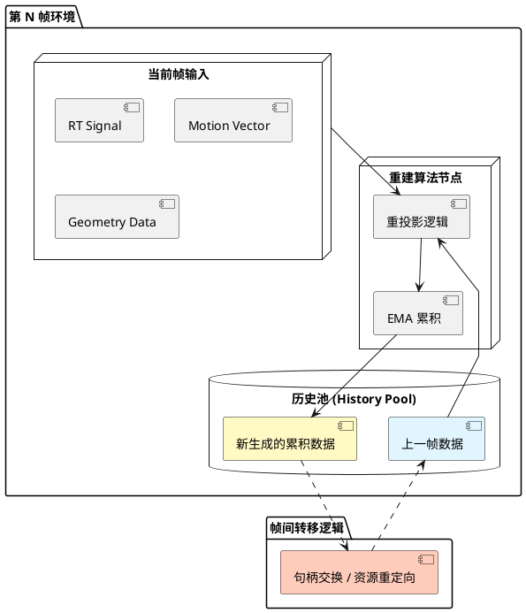
```plantuml
@startuml
skinparam backgroundColor white
skinparam shadowing false
skinparam linetype polyline

package "第 N 帧环境" {
    node "当前帧输入" as CurrentFrame {
        [RT Signal]
        [Motion Vector]
        [Geometry Data]
    }

    node "重建算法节点" as Pass {
        component "重投影逻辑" as Reprojection
        component "EMA 累积" as Accumulation
    }

    database "历史池 (History Pool)" {
        [上一帧数据] as History_Read #E1F5FE
        [新生成的累积数据] as History_Write #FFF9C4
    }
}

package "帧间转移逻辑" {
    [句柄交换 / 资源重定向] as Swap #FFCCBC
}

' Data Flow
CurrentFrame --> Reprojection
History_Read --> Reprojection
Reprojection --> Accumulation
Accumulation --> History_Write

' Lifecycle
History_Write ..> Swap
Swap ..> History_Read

@enduml
```

---
## 9. RenderGraph 生命周期流程图
**建议导出文件名：** `render_graph_lifecycle_flow.png` (对应 LaTeX Label: `fig:render_graph_lifecycle`)

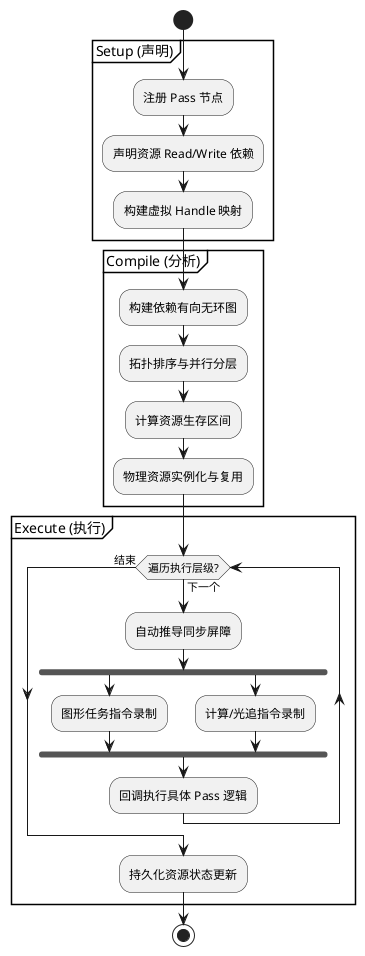
```plantuml
@startuml
skinparam backgroundColor white
skinparam shadowing false

start

partition "Setup (声明)" {
    :注册 Pass 节点;
    :声明资源 Read/Write 依赖;
    :构建虚拟 Handle 映射;
}

partition "Compile (分析)" {
    :构建依赖有向无环图;
    :拓扑排序与并行分层;
    :计算资源生存区间;
    :物理资源实例化与复用;
}

partition "Execute (执行)" {
    while (遍历执行层级?) is (下一个)
        :自动推导同步屏障;
        fork
            :图形任务指令录制;
        fork again
            :计算/光追指令录制;
        end fork
        :回调执行具体 Pass 逻辑;
    endwhile (结束)
    :持久化资源状态更新;
}

stop
@enduml
```

---
# 第四部分：动态逻辑图

## 12. 单帧生命周期活动图
**建议导出文件名：** `app_frame_activity.png` (对应 LaTeX Label: `fig:app_activity`)

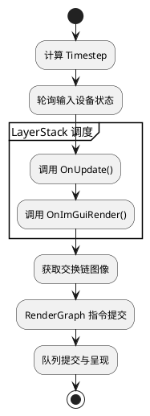
```plantuml
@startuml
skinparam backgroundColor white
skinparam shadowing false

start
:计算 Timestep;
:轮询输入设备状态;
partition "LayerStack 调度" {
    :调用 OnUpdate();
    :调用 OnImGuiRender();
}
:获取交换链图像;
:RenderGraph 指令提交;
:队列提交与呈现;
stop
@enduml
```

## 13. 异步加载顺序图
**建议导出文件名：** `async_loading_sequence.png` (对应 LaTeX Label: `fig:loading_sequence`)

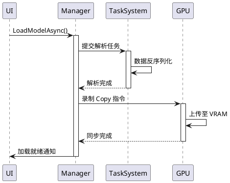
```plantuml
@startuml
skinparam backgroundColor white
participant "UI" as UI
participant "Manager" as RM
participant "TaskSystem" as TS
participant "GPU" as GPU

UI -> RM : LoadModelAsync()
activate RM
RM -> TS : 提交解析任务
activate TS
TS -> TS : 数据反序列化
TS --> RM : 解析完成
deactivate TS

RM -> GPU : 录制 Copy 指令
activate GPU
GPU -> GPU : 上传至 VRAM
GPU --> RM : 同步完成
deactivate GPU

RM -> UI : 加载就绪通知
deactivate RM
@enduml
```

## 14. RenderGraph 自动同步顺序图
**建议导出文件名：** `rg_sync_sequence.png` (对应 LaTeX Label: `fig:sync_sequence`)

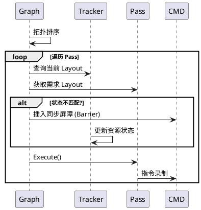
```plantuml
@startuml
skinparam backgroundColor white
participant "Graph" as RG
participant "Tracker" as TR
participant "Pass" as PN
participant "CMD" as CMD

RG -> RG : 拓扑排序
loop 遍历 Pass
    RG -> TR : 查询当前 Layout
    RG -> PN : 获取需求 Layout
    
    alt 状态不匹配?
        RG -> CMD : 插入同步屏障 (Barrier)
        TR -> TR : 更新资源状态
    end
    
    RG -> PN : Execute()
    PN -> CMD : 指令录制
end
@enduml
```

## 15. 参数动态调节顺序图
**建议导出文件名：** `param_adjustment_sequence.png` (对应 LaTeX Label: `fig:param_sequence`)

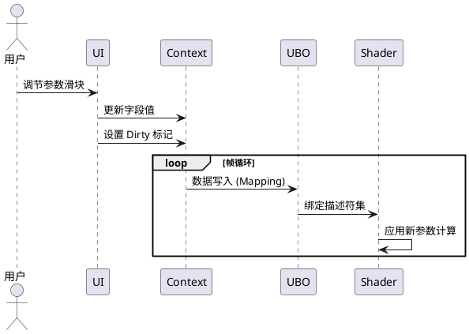
```plantuml
@startuml
skinparam backgroundColor white
actor "用户" as User
participant "UI" as UI
participant "Context" as Context
participant "UBO" as UBO
participant "Shader" as Shader

User -> UI : 调节参数滑块
UI -> Context : 更新字段值
UI -> Context : 设置 Dirty 标记

loop 帧循环
    Context -> UBO : 数据写入 (Mapping)
    UBO -> Shader : 绑定描述符集
    Shader -> Shader : 应用新参数计算
end
@enduml
```

---
## 16. 系统渲染数据流图 (DFD)
**建议导出文件名：** `render_dfd_refined.png` (对应 LaTeX Label: `fig:render_dfd`)

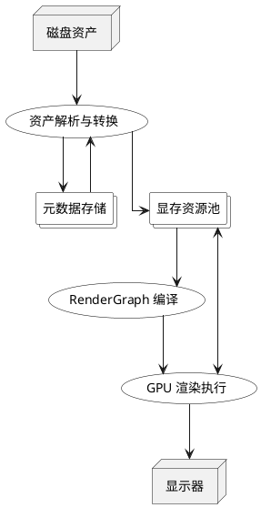
```plantuml
@startuml
skinparam backgroundColor white
skinparam shadowing false
skinparam linetype ortho

skinparam usecase {
    BackgroundColor White
    BorderColor Black
}
skinparam collections {
    BackgroundColor White
    BorderColor Black
}

node "磁盘资产" as Disk
node "显示器" as Monitor

usecase "资产解析与转换" as P1
usecase "RenderGraph 编译" as P2
usecase "GPU 渲染执行" as P3

collections "元数据存储" as RAM
collections "显存资源池" as VRAM

Disk --> P1
P1 --> RAM
RAM --> P1
P1 --> VRAM

VRAM --> P2
P2 --> P3

VRAM <--> P3
P3 --> Monitor
@enduml
```

---
## 17. 混合管线执行时序图
**建议导出文件名：** `hybrid_pipeline_sequence.png` (对应 LaTeX Label: `fig:hybrid_sequence`)

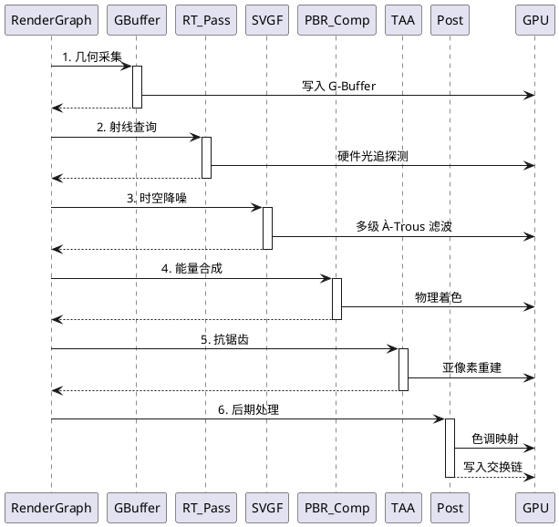
```plantuml
@startuml
skinparam backgroundColor white
skinparam shadowing false
skinparam sequenceMessageAlign center

participant "RenderGraph" as RG
participant "GBuffer" as GB
participant "RT_Pass" as RT
participant "SVGF" as SVGF
participant "PBR_Comp" as Comp
participant "TAA" as TAA
participant "Post" as Post
participant "GPU" as GPU

RG -> GB : 1. 几何采集
activate GB
GB -> GPU : 写入 G-Buffer
GB --> RG 
deactivate GB

RG -> RT : 2. 射线查询
activate RT
RT -> GPU : 硬件光追探测
RT --> RG 
deactivate RT

RG -> SVGF : 3. 时空降噪
activate SVGF
SVGF -> GPU : 多级 À-Trous 滤波
SVGF --> RG 
deactivate SVGF

RG -> Comp : 4. 能量合成
activate Comp
Comp -> GPU : 物理着色
Comp --> RG 
deactivate Comp

RG -> TAA : 5. 抗锯齿
activate TAA
TAA -> GPU : 亚像素重建
TAA --> RG 
deactivate TAA

RG -> Post : 6. 后期处理
activate Post
Post -> GPU : 色调映射
Post --> GPU : 写入交换链
deactivate Post
@enduml
```
